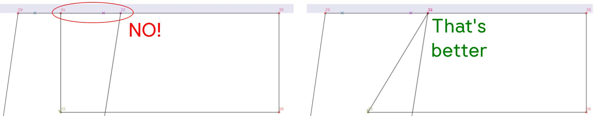
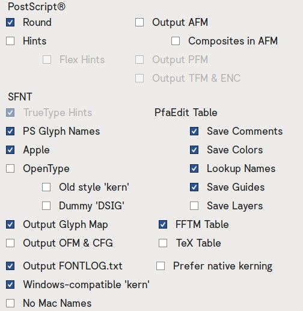

# Contributing

Here are some guidelines if you want to help the project.

Summary of this document:
1. [Reporting a bug](#reporting-a-bug)
2. [Suggestions](#suggestions)
3. [Developing the font](#contributing)

## Reporting a bug

If you see something you believe is going wrong with the font, [open an issue](https://github.com/Corne2Plum3/Giphurs/issues) and select "_Bug Report_".

>[!IMPORTANT]
> Before submitting a bug report, ensure that you are using the latest release of the font. Maybe the bug you have has been fixed. Issues from outdated versions of the font won't be considered.
> Also, check if an open issue already exists for your problem, to avoid duplicates. 

When writing your bug report, clearly state what is wrong, if possible with screenshots, where you got this bug, and finally which version of the font you are using:
* The version in the font file if this is a release
* Commit number or roughly latest merged Pull Request if you are developing

It would help a lot if the bug can be reproduced by someone else than yourself.

## Suggestions

If you have any suggestion about the font, for example features requests or design feedback, [open an issue](https://github.com/Corne2Plum3/Giphurs/issues) and select "_Suggestion_".

## Developing the font

Wait, you actually want to contribute to the source code OwO? Sure you can, but there are some stuff you have to know before you start.

1. There's a [project tab]([https://github.com/Corne2Plum3/Giphurs/projects]) with a list of tasks and their status. If a task is marked as "_In Progress_", please contact the person working on it before starting.
2. If you do something not planned, state why are you doing this.
3. Whatever if a contribution is accepted or not is at the sole discretion at the project's maintainer(s).
4. **Do NOT** update the binaries inside `fonts/` and the images with `make images`. This is only done by the project's maintainer(s) when releasing the font.

Don't forget that the latest commit in `master` branch is something that work: every `make` command must work as intended without errors.

### Rules regarding the font binaries and the images

> [!IMPORTANT]
> Only the project's maintainer(s) are allowed to do this.

A dedicated branch and pull request must be created for this process.

1. The version string is updated inside the Makefile (`FONT_VERSION` variable), then the following command is used:
    ```sh
    make ufo_set_version
    ```
2. The year inside each UFO (the "_Copyright XXXX The Giphurs Project Author_" string) and inside `OFL.txt` are correct.
3. All UFOs are opened with FontForge then immediately exported as UFO3 (see [Rules regarding the sources files (UFO)](#rules-regarding-the-sources-files-ufo))
4. A git commit is created.
5. Font binaries are generated with the building script:
    ```sh
    make clean && make clean_fonts
    make build
    ```
6. The font is tested to ensure everything is okay:
    ```sh
    make tests && make proof
    ```
7. Images are updated.
    ```sh
    make images
    ```
8. A new git commit is created and the pull request is created inside GitHub, then pull request is merged.
9. The release is created inside [GitHub's release page](https://github.com/Corne2Plum3/Giphurs/releases), and contains a changelog and an archive created with `make archive`.

### Rules regarding the scripts

Only use Python if possible, then bash script that can run in most Linux distributions without needing to download anything. Ensure all dependencies you are using are listed inside `requirements.txt`. The goal is when you clone the project and create the virtual environment, everything works.

If something else is really needed, open an issue or create a **draft** pull request with your progress, and explain what you need and why.

And obviously everything should work as intended (no error, crash, etc.).

> [!NOTE]
> If you are adding or changing a command inside the _Makefile_, ensure the command is listed inside the `help` command, and that the description is up to date.

### Rules regarding the sources files (UFO)

The font is being created using [FontForge](https://fontforge.org/en-US/) but we are using the [Unified Font Object](https://unifiedfontobject.org/) (UFO) format, version 3. You can use another program if you want, but the UFOs must be able to be read by FontForge, and exporting it to UFO through FontForge must not cause any data loss (= the font remains the same).

Assuming you are using FontForge:

1. The glyphs **must** follow the "spirit" of the font (no serifs, stroke thickness, terminations, etc.) Read the [Design Guidelines](https://github.com/Corne2Plum3/Giphurs/wiki/Design-guidelines) inside the font's wiki.
2. You **must not** use the **integrated accented or composite glyph** build feature. Instead use the composed glyph script (see `README.md` inside `scripts/` for more information).
3. You **must not** include any hints. Ensure to delete all of them. The hints are added when building the font binaries.
4. All points coordinates must be **rounded to integer**.
5. Only use the `Fore` layer. For the guides, you can do as you want.
6. **Avoid** if possible to have the **first point** in a outline at the **same place** than another point.
7. **Avoid** overlapping segments, otherwise rendering at small size might be shit (see image below).
    
8. If possible, try to **not remove overlaps** if your glyph is made of several segments.
9. Make the outermost outline going **clockwise**.
10. Ensure each outline are in the same order and includes the same amount of points across all weights. The direction of each outline must be the same.
    > [!NOTE]
    > The normal and italic version of the font are independent.
11. All extremas in curves **must** be a point, especially for the outermost contour, unless interpolation between weights forces it and there are no way around. If possible, try to use the least amount of points.
12. You must **not** change existing font's metadata (name, version, etc.) unless this is really needed. Version is only done by the project's maintainer(s) when making a new release of the font. If you wish to do such changes, open an issue.
13. If FontForge crashes and when restarting it asks you to recover your file, **do not accept**. From experience, doing this breaks the font.
14. Do **not** save the font as SFD file (what you get using the _File / Save_ option). Instead, export the font with _file / Generate Fonts_ with **UFO3** format, **without bitmap** font and **do not rename** glyphs. Ensure you are using these options:
    
    > [!IMPORTANT]
    > If you use other options, you **must** show in your pull request what export options you used and explain why.
15. All glyphs in all UFOs must be in the same order (=`glyphs/fontinfo.plist` are the same).
16. **Do NOT** manually edit the UFOs file with something else than FontForge before commit.
17. The font **must** be able to compile with `make build`, and all files are generated. The `make tests` command report **must not** have any **FATAL** or **FAIL** _(unless this is impossible to avoid but this is very rare)_.

> [!TIP]
> If you are adding new glyphs, consider the following:
> * If applicable, check the font features and lookups, your glyph might have a character variant or be part of a stylistic set _(for example, you make a glyph that's similar to the letter G -> create a `cv21` variant and update the `cv21` lookup)_.
> * Adding an accented or composed glyph?
>       1. Put anything in the glyph (do not keep it empty otherwise it won't be exported, and the glyph needs to exist before next step). What I do personally is 
>       2. Add it to `composed_glyphs.csv`. Read `scripts/README.md` to see how to fill this file.
>       3. Run `make ufo_composed_glyphs` command.
>       4. For all UFOs, open them and export them as UFO3 with FontForge _(you need to do that before the script does not updates `features.fea`)_.