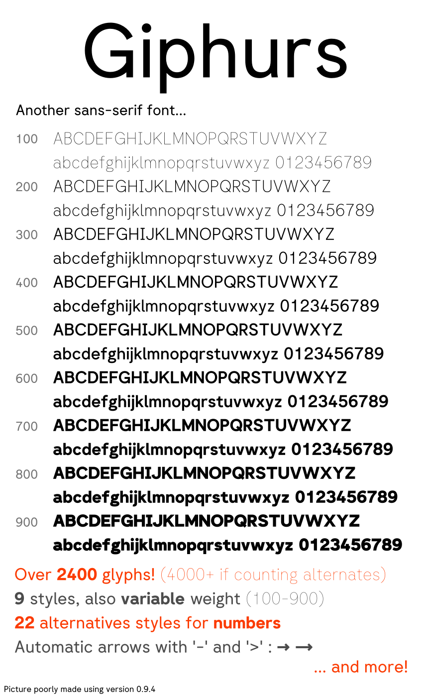

# Giphurs font

Your average Arial/Helvetica/Circular on budget, made with [Fontforge](https://fontforge.org/en-US/).



# Status of the project

The font itself works fine, but there's still stuff to do, and things may change at any time.

The end goal is to upload this font on [Google Fonts](https://fonts.google.com/).

I'm aware that there's already some issues, for example the font version being invalid for Google Fonts, but while I don't have a finished version, the version will be still under 1.0, it's intended.

# TODO list

* Add italic.
* Fix other small problems that [Font Bakery](https://github.com/googlefonts/fontbakery) complains about.
* Improve font documentation (if it even exists).
* Add better pictures of the font and better description.

Real list is here: https://github.com/users/Corne2Plum3/projects/2

# Download

Go in [releases](https://github.com/Corne2Plum3/Giphurs/releases) page and pick the latest version. The font is available in the following formats: `otf`, `ttf` and `woff2`.

You also have "SC" versions of the font (currently available for weights 400 and above) which uses small caps.

Note that these are currenly pre-releases, so the font may contain issues and everything can be changed in the future.

# Build the fonts

## 0. Requirements

Before going further, you're going to need these.

* [Python 3.10](https://www.python.org/downloads/) or newer version.
* [pip](https://pypi.org/project/pip/) to install the Python packages (see below).

## 1. Setup

Everything that you will need will be installed on a virtual environment (so Debian/Ubuntu won't complain about it because of the Python packages). So in this section you will make a virtual environment and add the dependencies inside.

**Note:** The following guide has been tested only on Linux, on Debian based distros (more exactly Debian 12 and Ubuntu 23.10). If you managed to generate the fonts file from another distribution (or another OS), you can open a PR so we can add it here.

1. Ensure that the current working directory is the root of the project. If not, run the following command, replacing `path/to/the/folder/project` by the path of the directory of the project, basically where the file you're reading right now is in.
	```sh
	cd path/to/the/folder/project
	```

2. Create a python virtual environment. To do so, execute:
	```sh
	python3 -m venv venv
	```

3. Move to the virtual environment you just have created:
	```sh
	source venv/bin/activate 
	```

4. Now we're intalling the  Python packages. All of them are listed in the `requirements.txt`. To install all of them with the correct version, run the following command:
	```sh
	pip install -r requirements.txt
	```

## 2. Build the font

Once all dependencies are ready, you can finally build the font. Inside the `sources` folder you have different scripts to make the font files. All of them **must** be run with the `sources` folder as working directory else they won't work. If you just want to build the font, just run:
```sh
make fonts
```
(it will also run `make ufo` if you don't have these)

### List of the available scripts

Since v0.8.0, a Makefile is used to build the fonts. Your working directory must be where the Makefile is (aka in the root folder of the repo)

* `make fonts`: build the font files: `otf`, `ttf` (static + variable) and `woff2`. Needs the `ufo` files created before.

* `make export_fonts`: create a `zip` archive of the `fonts` folder. Note that it doesn't change its content.

* `make clean`: removes the files generated during the build.

# License
This font is under the [SIL Open Font License, Version 1.1](https://scripts.sil.org/OFL).
