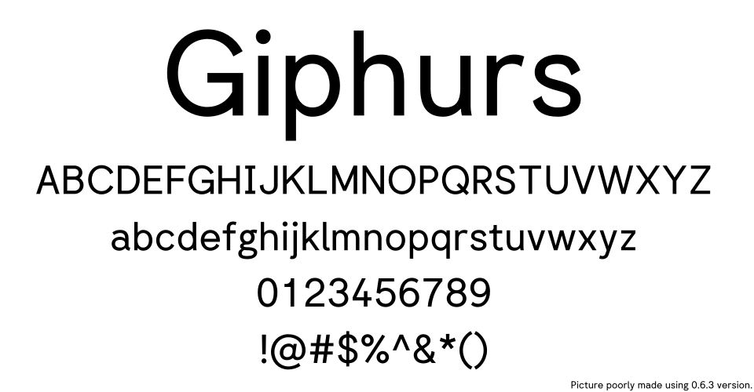

# Giphurs font

Your average Arial/Helvetica/Circular on budget, made with [Fontforge](https://fontforge.org/en-US/).




## Status of the project

This project **isn't complete and is under developpement**. Things may change at any time.

# IMPORTANT

The end goal is to upload this font on [Google Fonts](https://fonts.google.com/).

I'm aware that there's already some issues, for example the font version being invalid for Google Fonts, but while I don't have a finished version, the version will be still under 1.0, it's intended.

## TODO list
* Fix other small problems that [Font Bakery](https://github.com/googlefonts/fontbakery) complains about.
* Improve font documentation (if it even exists).
* Bring back '`calt`' features which couldn't be added to the build (example change `:` height between 2 numbers)
* Add the other weights (100, 200, ..., 900?)
* Add italic.
* Add better pictures of the font and better description.


# Download

Go in [releases](https://github.com/Corne2Plum3/Giphurs/releases) page and pick the latest version. The font is available in the following formats: `otf`, `ttf` and `woff2`.

Note that these are currenly pre-releases, so the font may contains issues and everything can be changed in the future.

# Build the fonts

## 0. Requirements

Before going further, you're going to need these.

* [Python 3.10](https://www.python.org/downloads/) or newer version.
* [pip](https://pypi.org/project/pip/) to install the Python packages.
* [woff2](https://github.com/google/woff2) to convert `ttf` files to `woff2`

## 1. Setup

Everything that you will need will be installed on a virtual environment. So in this section you will make a virtual environmenent and add the dependencies inside (they're all based on Python stuff so it should be simple).

**Note: for now, the guide only works on Debian based distros (especially section 1.2). I'll try to extand to other distros where I try to build the font. through another distro, open a PR where you had how you managed to do it.**

### 1.1. Create the virtual environment

In this section you will make a virtual environmenent and add the dependencies inside, so you don't touch your existing system.

1. Ensure that the current working directory is the root of the project. If not, run the following command, replacing `path/to/the/folder/project` by the path of the directory of the project, basically where the file you're reading right now is in.
	```sh
	cd path/to/the/folder/project
	```

2. Create a python virtual environment. To do so, execute:
	```sh
	python3 -m venv venv
	```

3. Move to the virtual environment you just have created:
	```sh
	source venv/bin/activate 
	```
### 1.2. Install the Python packages

In this section you will install the dependencies (all Python libraries) inside the virtual environment. All of them are listed in the `requirements.txt` file, except one, `fontforge` which cannot be obtained through `pip`, but it can be obtened through a package manager (for example `apt`). 

1. Install all the python packages from `requirements.txt`:
	```sh
	pip install -r requirements.txt
	```

2. Now let's install the `fontforge` module inside the virtual environement. First we need to download it (and NOT install it for now)
	```sh
	sudo apt download python3-fontforge
	```

3. Once the package downloaded, you should have get a `.deb` file. Let's extract its content and store it on a folder called `temp`. Don't forget to replace the `python3-fontforge.deb` by the name of the `.deb` obtained previously.
	```sh
	dpkg -x python3-fontforge.deb temp/
	```

4. Move the content of `temp/` (the Python package that we need) inside the virtual environement created earlier. Its folder should be called `venv`. As the folder names may varies, locate inside the `venv` where the python packages are installed. For example: `venv/lib/python3.11/site-packages/`. You should end up in a directory with a lot of directories, with some of them with the name of packages installed in step 1. It's here you gonna add the `fontforge` package. Run the following command: 
	```sh
	mv ./temp/usr/lib/python3/dist-packages/* ./venv/lib/python3.11/site-packages/
	```
	Don't forget to replace the 2nd argument (`./venv/lib/python3.11/site-packages/`) by the name of the folder you located above.

5. Delete the `temp` folder and the `.deb` file as we don't need them anymore.
	
6. To ensure that `fontforge` is installed inside the virtual environement:
	* If you're not yet inside the virtual environement, to the step 3 from the section 1.
	* Then, run "`python3`" in your terminal.
	* Once in the Python console, run "`import fontforge`". If you don't get an error, it's fine.

## 2. Build the font

Once all dependencies are ready, you can finally build the font. Inside the `sources` folder you have differents scripts to make the font files. All of them **must** be run with the `sources` folder as working directory else they won't work.

### List of th available scripts

* `build_sources.sh`: before being converted into font files, the sources files (the `.sfd` files) are first converted into [UFO files](https://en.wikipedia.org/wiki/Unified_Font_Object) before being compiled by [Fontmake](https://github.com/googlefonts/fontmake). This is what this script does, where the `.sfd` are first cleaned (for example, correcting directions and overlaps) and put into the `sfd_cleaned` folder, then converted into UFO inside `ufo` folder.

* `build_fonts.sh`: this program will takes the UFO files (or generate them if needed) and compile them into the chosen file format. This program takes at least 1 argument which is the desired font file extension:
	* `otf`
	* `ttf`
	* `woff2` (or `webfonts`) (needs the **ttf** files first!)
	* Or `all` to generate all formats above.

	You can add `-b` as a second argument like below to force the script to force rebuilding the UFO files, for example:
	```sh
	./build_fonts.sh otf -b
	```
	...which generate the OTF files but also rebuild the sources for the compilation.

* `clean.sh`: remove the files that has been generated by the script to build the fonts, including UFO files but **not** the final font files (e.g. don't delete `fonts` folder).

# License
This font is under the [SIL Open Font License, Version 1.1](https://scripts.sil.org/OFL).
 

