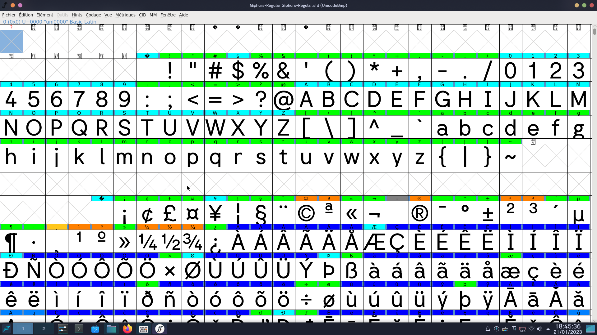

# Giphurs font

Your average Arial/Helvetica/Circular on budget UwU.



# Status of the project

This project **isn't complete and is under developpement**. Things may change at any time.

The end goal is to upload this font on [Google Fonts](https://fonts.google.com/).

I'm aware that there's already some issues, for example the font version being invalid for Google Fonts, but while I don't have a finished version, the version will be still under 1.0, it's intended.

## TODO list
* Fix other small problems that [Font Bakery](https://github.com/googlefonts/fontbakery) complains about.
* Bring back '`calt`' features which couldn't be added to the build (which for example change the width of the )
* Add the other weights (100, 200, ..., 900?)
* Add italic.
* Add better pictures of the font.

# Build the fonts
This repo provides differents scripts to make the font files, inside the `sources` folder.
**Ensure that the source folder is your current working directory else they won't work!!!**

* `build_sources.sh`: before being converted into font files, the sources files (the `.sfd` files) are first converted into [UFO files](https://en.wikipedia.org/wiki/Unified_Font_Object) before being compiled by [Fontmake](https://github.com/googlefonts/fontmake). This is what this script does, where the `.sfd` are first cleaned (for example, correcting directions and overlaps) and put into the `sfd_cleaned` folder, then converted into UFO inside `ufo` folder.

* `build_fonts.sh`: this program will takes the UFO files (or generate them if needed) and compile them into the chosen file format. This program takes at least 1 argument which is the desired font file extension:
	* `otf`
	* `ttf`
	* `woff2` (or `webfonts`) (needs the **ttf** files first!)
	* Or `all` to generate all formats above.

	You can add `-b` as a second argument like below to force the script to force rebuilding the UFO files, for example:
	```sh
	./build_fonts.sh otf -b
	```
	...which generate the OTF files but also rebuild the sources for the compilation.

* `clean.sh`: remove the files that has been generated by the script to build the fonts, including UFO files but **not** the final font files (e.g. don't delete `fonts` folder).

# License
This font is under the [SIL Open Font License, Version 1.1](https://scripts.sil.org/OFL).
 

