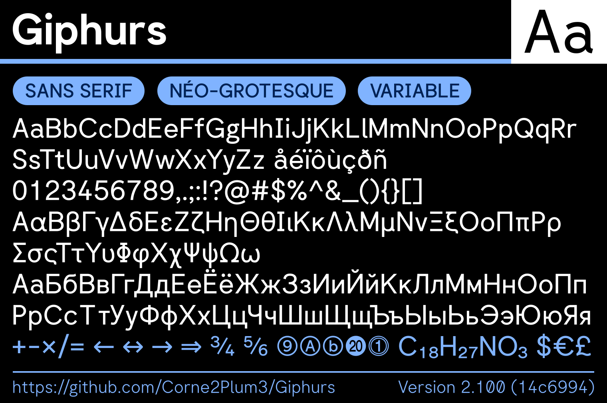
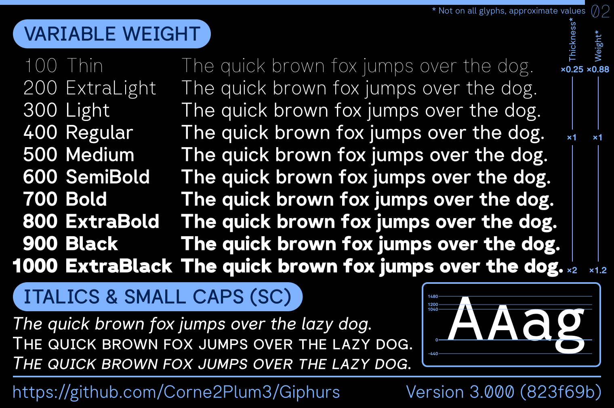
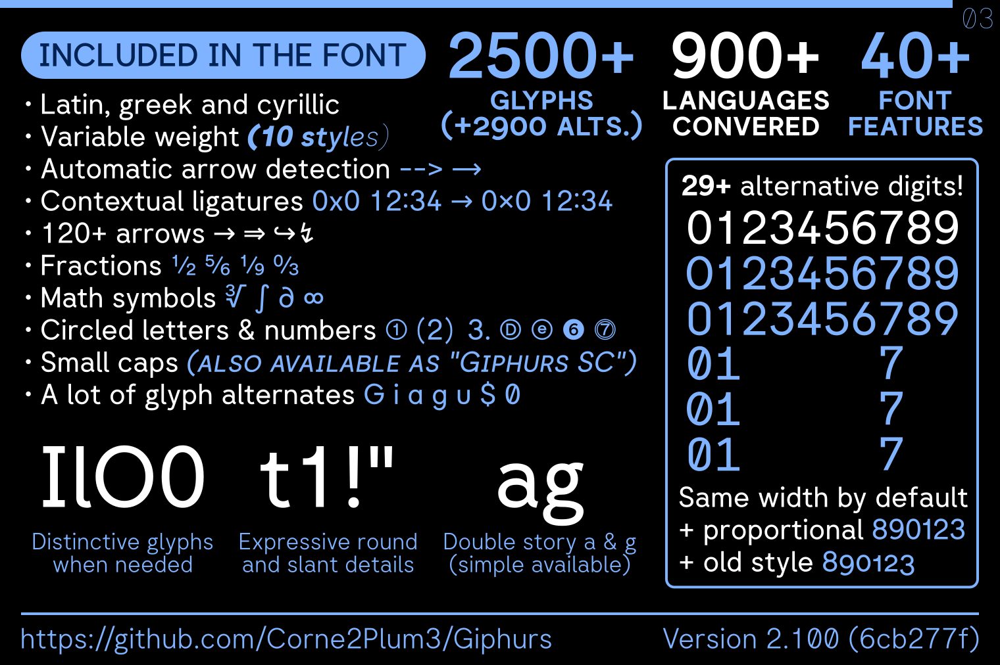

# Giphurs font

<p align="center">
	<a href="https://github.com/Corne2Plum3/Giphurs/stargazers"></a>
	<a href="https://github.com/Corne2Plum3/Giphurs/releases"></a>
	<a href="https://github.com/Corne2Plum3/Giphurs/releases/latest"></a>
	<a href="https://github.com/Corne2Plum3/Giphurs/releases/latest"></a>
	<a href="./output/fontbakery/fontbakery-report.html"></a>
</p>



Your average **sans serif** font similar to _Arial_ or _Helvetica_, made with [FontForge](https://fontforge.org/en-US/), with a goal of being simple, readable and multipurpose. And it is free and open-source too!

It is a variable font, with the weight customizable across a wide range, and a lot of different [OpenType features](https://github.com/Corne2Plum3/Giphurs/wiki/OpenType-font-features) to customize the font. The font covers quite a large amount of glyphs, over **2500** glyphs, and supports more than **600** [languages](https://github.com/Corne2Plum3/Giphurs/wiki/Supported-languages-list) (according to [hyperglot](https://github.com/rosettatype/hyperglot)).






# Why?

One day, a dude called [Corne2Plum3](https://github.com/Corne2Plum3) randomly wanted to create a custom font, and made this, a sans serif font inspired by Arial, Helvetica, Circular Std and Inter, a simple font that can be used in various situations: for example on a computer screen, on professional mails, on documents, etc. A simple font that also match his 99+ random whishes regarding the font design, such as (but not only):

* Fixed width numbers
* The design of digit 4 and small letter g
* Being able to make the difference between the capital letter I and the small letter L
* He likes the design
* Being free and can be used by anyone without being bothered by licensing and money
* Having several weights

Well at the end, after more than 2 years, there's a final product, and literally 0.00 dollars were spent in the project. Given the amount of glyphs in this font, it gone probably too far...

# Status of the project

The font is almost finished, it only requires some polishing and minor bug fixing and improvements.

The end goal is to upload this font on [Google Fonts](https://fonts.google.com/).

The full list of tasks is here: https://github.com/users/Corne2Plum3/projects/4

# Download

Go in [releases](https://github.com/Corne2Plum3/Giphurs/releases) page and pick the latest version. The font is available in the following formats: `otf`, `ttf` and `woff2`.

You also have "SC" versions of the font which uses small caps for lowercase characters.

# Building the fonts

## 0. Requirements

Before going further, you're going to need these installed on your system to compile the font and create the images.

Mandatory:

* [Python 3.13](https://www.python.org/downloads/) (other version not tested).
* [pip](https://pypi.org/project/pip/) to install the Python packages (see below).

Optional(-ish):

* [fontspector](https://github.com/fonttools/fontspector/blob/main/INSTALLATION.md) for testing the font.
	* Or use the [web-based version](https://fonttools.github.io/fontspector/)
* [inkscape](https://inkscape.org/) that can be accessed through command line to generate images of the font.
	* Otherwise something else that can convert SVG to PNG with font features support

And of course a font editor with support of [Unified Font Object](https://unifiedfontobject.org/) version 3 if you want to change the font. [FontForge](https://fontforge.org/en-US/) is highly recommended as this is the editor used to create the font.

## 1. Setup

Everything that you will need will be installed on a virtual environment (so Debian/Ubuntu won't complain about it because of the Python packages). So in this section you will make a virtual environment and add the dependencies inside.

> [!NOTE]
> The following guide has been tested on Linux only (Debian/Ubuntu).

1. Ensure that the current working directory is the root of the project. If not, run the following command, replacing `path/to/the/folder/project` by the path of the directory of the project, basically where the file you're reading right now is in.
	```sh
	cd path/to/the/folder/project
	```

2. Create a python virtual environment. To do so, execute:
	```sh
	python3 -m venv venv
	```

3. Move to the virtual environment you just have created:
	```sh
	source venv/bin/activate 
	```

4. Now we're installing the  Python packages. All of them are listed in the `requirements.txt`. To install all of them with the correct version, run the following command:
	```sh
	pip install -r requirements.txt
	```

## 2. Build the font

Once all dependencies are ready, you can build the fonts using the following command (add `-B` if you want to build the font and that it says that "fonts" is already up to date):
```sh
make clean && make clean_fonts
make build
```

> [!NOTE]
> Run the first command if this isn't the first time you are compiling the font. Sometimes the font binaries aren't updates (and we don't know why...)

More commands are listed in the Makefile. Just run `make help` to get the list of commands.


# License

This font is under the [SIL Open Font License, Version 1.1](https://scripts.sil.org/OFL).


# Credits

The fraktur glyphs (`U+210C`, `U+2111`, `U+211C`, `U+2128` and `U+212D`) are from [_Noto Sans Math_](https://github.com/notofonts/math) because they are too hard to draw. _Noto Sans Math_ is licensed under the  [SIL Open Font License, Version 1.1](https://openfontlicense.org/open-font-license-official-text/).
