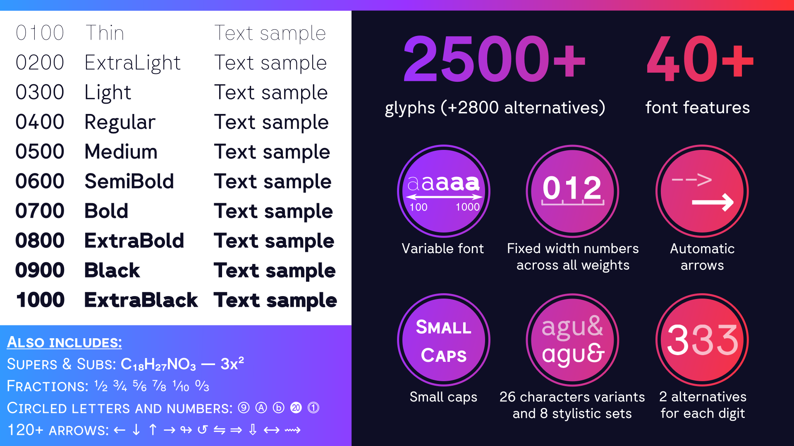

# Giphurs font

<p align="center">
	<a href="https://github.com/Corne2Plum3/Giphurs/stargazers"></a>
	<a href="https://github.com/Corne2Plum3/Giphurs/releases"></a>
	<a href="https://github.com/Corne2Plum3/Giphurs/releases/latest"></a>
	<a href="https://github.com/Corne2Plum3/Giphurs/releases/tag/v1.9.9"></a>
	<a href="https://github.com/Corne2Plum3/Giphurs/releases/latest"></a>
	<a href="https://github.com/Corne2Plum3/Giphurs/releases/tag/v1.9.9"></a>
	<a href="./output/fontbakery/fontbakery-report.html"></a>
</p>

Your average Arial/Helvetica/Circular **sans serif** font, made with [Fontforge](https://fontforge.org/en-US/), with a goal of being simple, readable and multipurpose.

It is a variable font, with the weight customizable across a wide range, and a lot of differents [OpenType features](https://github.com/Corne2Plum3/Giphurs/wiki/OpenType-font-features) to customize the font. The font covers quite a large amount of glyphs, over **2500** glyphs, and supports more than **600** [languages](https://github.com/Corne2Plum3/Giphurs/wiki/Supported-languages-list) (according to [hyperglot](https://github.com/rosettatype/hyperglot)).





# Why?

One day, a dude called [Corne2Plum3](https://github.com/Corne2Plum3) randomly wanted to create a custom font, and made this, a sans serif font inspired by Arial, Helvetica, Circular Std and Inter, a simple font that can be used in various situations: for example on a computer screen, on professional mails, on documents, etc. A simple font that also match his 99+ random whishes regarding the font design, such as (but not only):

* Fixed width numbers
* The design of digit 4 and small letter g
* Being able to make the difference between the capital letter I and the small letter L
* He likes the design
* Being free and can be used by anyone without being bothered by licensing and money
* Having several weights

Well at the end, after more than 2 years, there's a final product, and literally 0.00 dollars were spent in the project. Given the amount of glyphs in this font, it gone probably too far...

# Status of the project

The font itself works fine, but there's still stuff to do, and things may change at any time (althrough it's relatively stable now)

The end goal is to upload this font on [Google Fonts](https://fonts.google.com/).

The full list of tasks is here: https://github.com/users/Corne2Plum3/projects/4

# Download

Go in [releases](https://github.com/Corne2Plum3/Giphurs/releases) page and pick the latest version. The font is available in the following formats: `otf`, `ttf` and `woff2`.

You also have "SC" versions of the font (currently available for all weights except 1000) which uses small caps instead of lowercase characters.

You can choose between 2 versions:

* The latest stable version: [1.2.2](https://github.com/Corne2Plum3/Giphurs/releases/tag/v1.2.2)
* An experimental/preview of 2.0, featuring *italics*: [1.9.9](https://github.com/Corne2Plum3/Giphurs/releases/tag/v1.9.9) (not recommended for production)

# Build the fonts

## 0. Requirements

Before going further, you're going to need these.

* [Python 3.10](https://www.python.org/downloads/) or newer version.
* [pip](https://pypi.org/project/pip/) to install the Python packages (see below).

## 1. Setup

Everything that you will need will be installed on a virtual environment (so Debian/Ubuntu won't complain about it because of the Python packages). So in this section you will make a virtual environment and add the dependencies inside.

**Note:** The following guide has been tested only on Linux, on Debian based distros (more exactly Debian 12 and Ubuntu 23.10). If you managed to generate the fonts file from another distribution (or another OS), you can open a PR so we can add it here.

1. Ensure that the current working directory is the root of the project. If not, run the following command, replacing `path/to/the/folder/project` by the path of the directory of the project, basically where the file you're reading right now is in.
	```sh
	cd path/to/the/folder/project
	```

2. Create a python virtual environment. To do so, execute:
	```sh
	python3 -m venv venv
	```

3. Move to the virtual environment you just have created:
	```sh
	source venv/bin/activate 
	```

4. Now we're intalling the  Python packages. All of them are listed in the `requirements.txt`. To install all of them with the correct version, run the following command:
	```sh
	pip install -r requirements.txt
	```

## 2. Build the font

Once all dependencies are ready, you can build the fonts using the following command (add `-B` if you want to build the font and that it says that "fonts" is already up to date):

```sh
make build
```

Others commands are available in the Makefile. Just run `make` to get the list of commands.


# License

This font is under the [SIL Open Font License, Version 1.1](https://scripts.sil.org/OFL).


# Credits

Some glyphs (very complicated to draw) in the `U+21xx` range are stolen from [DejaVu Sans](https://github.com/dejavu-fonts/dejavu-fonts) and [Noto Sans](https://github.com/notofonts/notofonts.github.io), 

